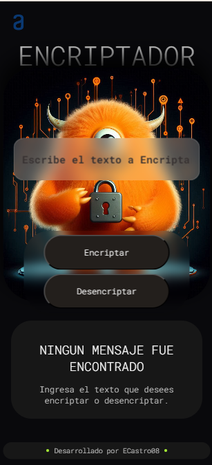
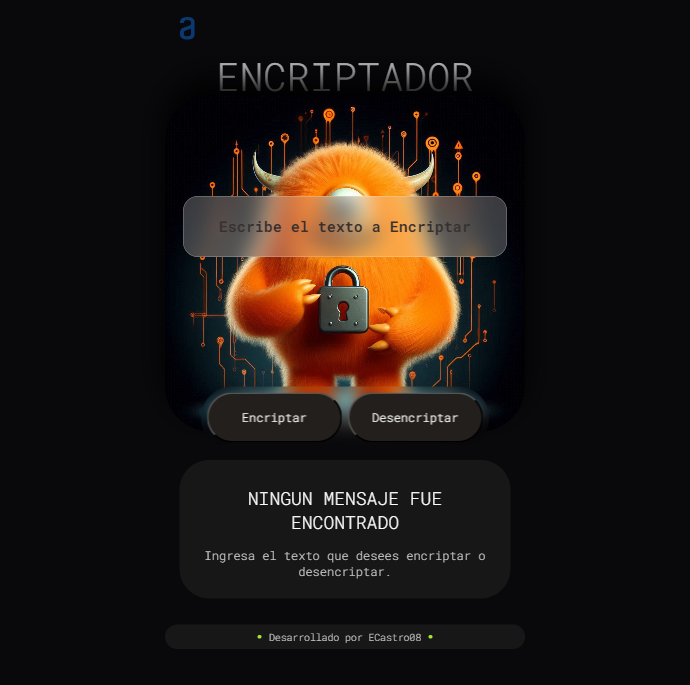
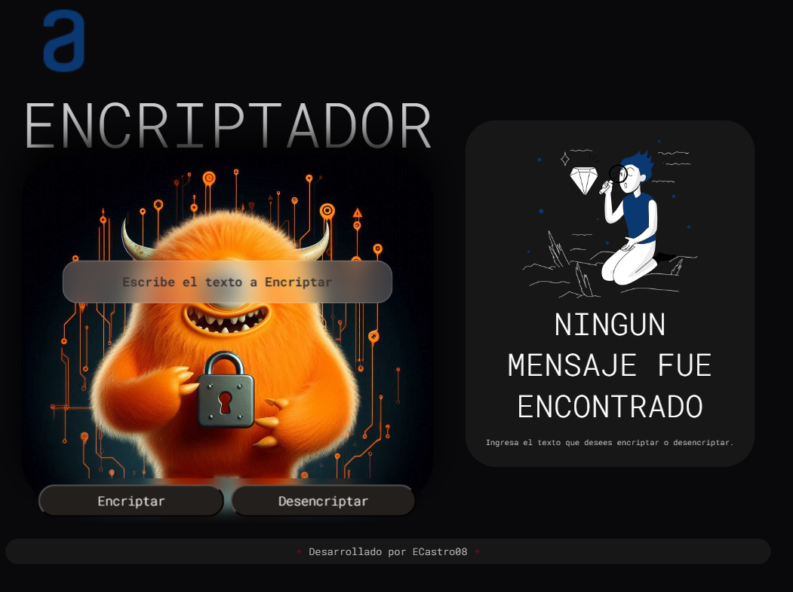

# Encriptador de Textos

## Descripción del Proyecto

Este proyecto consiste en una aplicación web que permite encriptar y desencriptar textos utilizando un conjunto de reglas de sustitución específicas. La aplicación está diseñada para funcionar en dispositivos móviles, tabletas y computadoras de escritorio.

## Funcionalidades

- Encriptación de textos utilizando reglas de sustitución.
- Desencriptación de textos previamente encriptados.
- Copia del texto encriptado/desencriptado al portapapeles.
- sin restriccion al momento de escribir mayusculas o minusculas

## Reglas de Encriptación

Las siguientes reglas fueron implementadas para la encriptación:

- `e` se convierte en `enter`
- `i` se convierte en `imes`
- `a` se convierte en `ai`
- `o` se convierte en `ober`
- `u` se convierte en `ufat`

## Capturas de Pantalla

### Versión Mobile

### Versión Tablet

### Versión Desktop

## Cómo Ejecutar el Proyecto

- Clona este repositorio.
- Abre el archivo index.html en tu navegador.
- ¡Comienza a encriptar y desencriptar textos!
### Créditos
Este proyecto fue desarrollado como parte de un desafío de programación.

